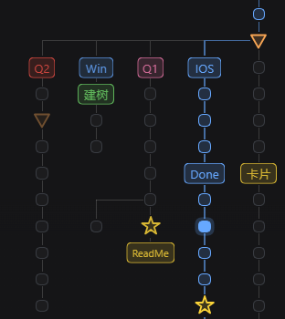
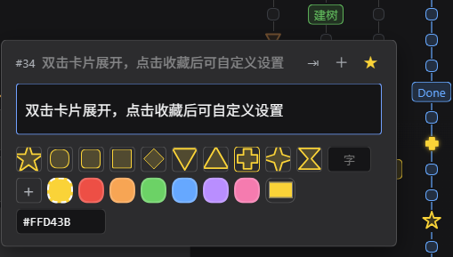
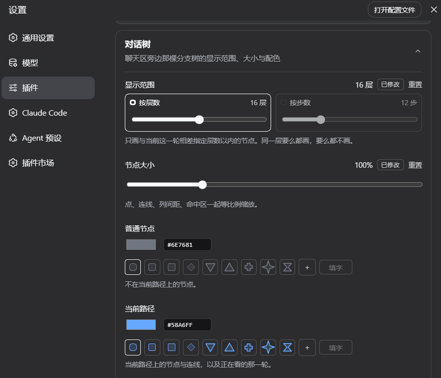

<p align="center">
  
</p>

<h1 align="center">dsh-tree</h1>

<p align="center">
  把一个对话的所有分支画成一棵树，贴在
  <a href="https://github.com/deepseek-ai">DeepSeek Harness</a> 聊天区右缘。<br>
  点节点跳到那一轮，点 <b>＋</b> 从那儿接着问。
</p>

<p align="center">
  <a href="README.md">English</a> · <b>中文</b>
</p>

---

## 安装

```sh
dsh plugin --profile web add github:JRJRJPRO/dsh-tree
```

刷新浏览器就能用 —— 不用重启 dsh，也不依赖任何其它插件。

卸载：`dsh plugin --profile web remove dsh-tree`。它也会出现在**插件市场的「已安装」**里，
那儿的开关就是启用 / 停用，约 1 秒生效。

## 树会自己出现



刷新页面，树已经在正文右边了。

一个点就是一轮对话，**单击跳到那一轮** —— 滚到哪一轮，哪个点就填实。

分支并排画，一眼看得出对话在哪儿岔开、你现在走在哪条路上。起过名字的节点，
名字直接写在树上。

<br clear="right">

## 每个节点都有一张卡片



悬浮到节点上出缩略卡，**双击卡片展开** —— 改名、挑形状、挑颜色、传张图都在这一档。

手机、平板这类没有悬停的设备上，点一下就是悬浮。

<br clear="right">

| | |
|---|---|
| **＋** | 从这一轮之后接着问，开一条新支线；在树根的空节点上则是在同一棵树里新开一条对话 |
| **☆** | 收藏。这个点变成金色五角星，还能单独换图标和颜色 |
| **⇥ / ⇤** | 把一条支线拆成独立的树 / 再接回去 |
| **⊕ / ⊖** | 把本目录下别的对话整棵合并进来 / 拆回去 |

灰掉的按钮表示现在做不了，鼠标停上去会写明原因。

## 颜色是有含义的

| | |
|---|---|
| 蓝色描边 | 这个节点在你当前的对话里 |
| 蓝色填充 | 你正看着这一轮 |
| 橙色倒三角 | 这一轮做过压缩 |
| 灰掉的支线 | 撤回掉的轮次，不再假装还在对话里 |

## 调成你喜欢的样子



**设置 → 插件 → 对话树**。

**显示范围**只画离当前这一轮足够近的节点，树再大也看得清。按层数或按步数，
喜欢哪种用哪种，两种都有「不省略」这一档。边界不硬切 —— 最外圈越画越小越淡，
鼠标滑上去就回来。

**节点大小**把点、连线、间距一起缩放，50%–250%。

**配色**一行一种节点，左边颜色右边形状。默认跟着你的浅色 / 深色主题走；
自己挑过的那一项就固定下来，按「重置」交还回去。

<br clear="right">

## 收藏图标

节点收藏之后，卡片上多出两排：

- **12 个形状** —— 圆 / 圆角方 / 方 / 菱形 / 三角 / 倒三角 / 箭头 / 五边形 / 六边形 / 十字 / 四角星 / 沙漏
- **一个字** —— 填一个字或 emoji，画成它外加一个圆角描边框
- **一张图** —— png / jpg / webp / svg 都行，尺寸不限，自动缩好。存在 `$DSH_HOME` 里，换浏览器也还在
- **颜色** —— 6 个预设 + 一格恢复默认 + 一个取色盘

---

想改代码：[AGENTS.md](AGENTS.md) · [DESIGN.md](DESIGN.md) · [NATIVE-BASELINE.md](NATIVE-BASELINE.md)

MIT
